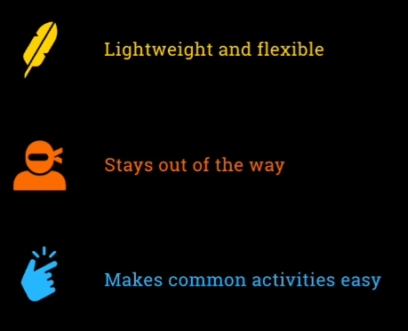
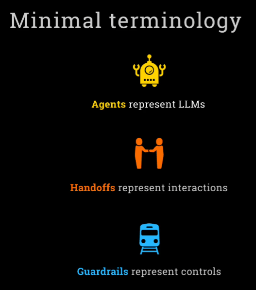
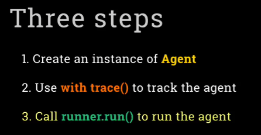
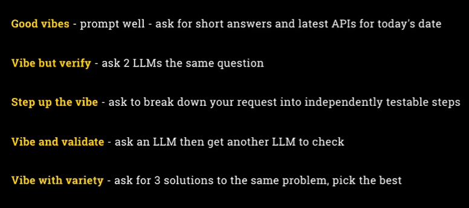
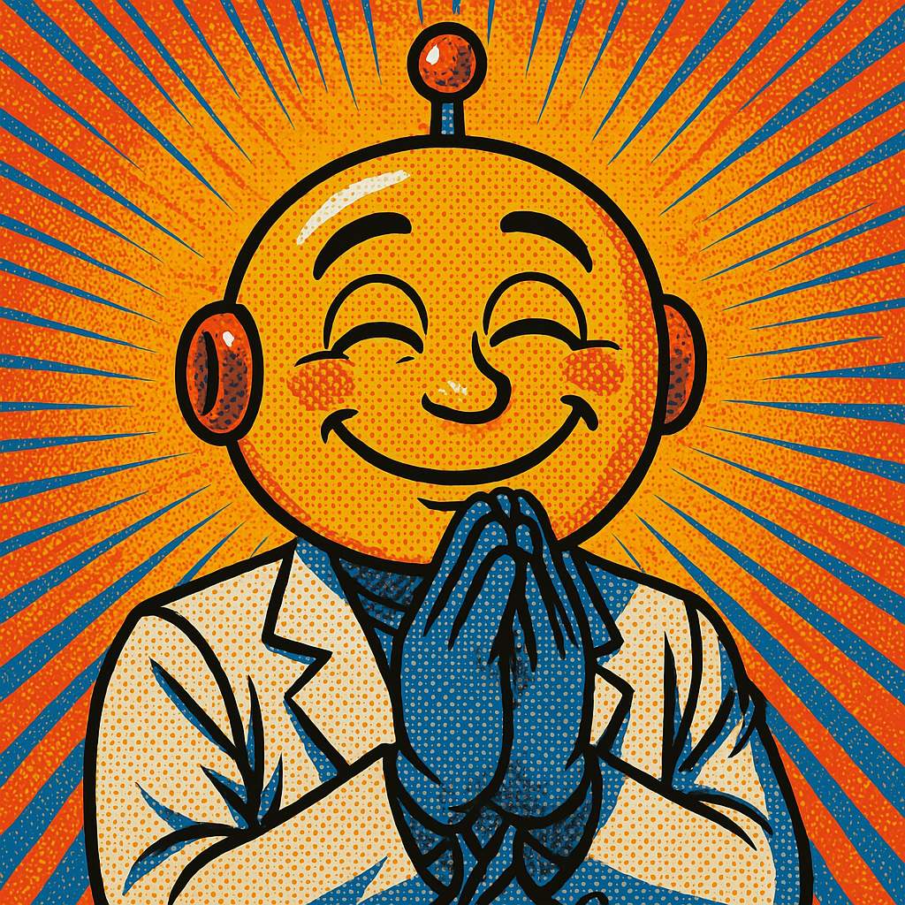

# 🤖 AI Agents Framework

  
  
  
  
  

    
  

<strong>Exploring the world of AI agents, workflows, and autonomous systems</strong>

---

## Table of Contents 📋
- [Getting Started](#getting-started-)
- [What Are AI Agents?](#what-are-ai-agents-)
- [Agentic Systems Architecture](#agentic-systems-architecture-)
- [Five Workflow Design Patterns](#five-workflow-design-patterns-)
- [Agents: Beyond Structured Workflows](#agents-beyond-structured-workflows-)
- [Risk Considerations](#risk-of-agent-frameworks-)
- [Agentic AI Frameworks](#agentic-ai-frameworks-)
- [Complex Frameworks](#complex-ones-)
- [Top Level Complex Frameworks](#top-level-complex-)
- [Resources vs Tools](#resources-vs-tools-the-building-blocks-)
- [OpenAI Agents SDK](#openai-agents-sdk-)
- [Contributing](#contributing-)

---

## Getting Started 🚀

---

## What Are AI Agents? 🧠
AI Agents are programs where LLM outputs control the workflow, featuring:

- **Multiple LLM calls** — Chaining language model interactions
- **LLMs with ability to use Tools** — Extending capabilities beyond text
- **An environment where LLMs interact** — Creating collaborative AI systems
- **A Planner to coordinate activities** — Orchestrating complex workflows
- **Autonomy** — Self-directed problem solving

---

## Agentic Systems Architecture 🏗️
Anthropic distinguishes two types of systems:

- **Workflows:** Systems where LLMs and tools are orchestrated through predefined code paths
- **Agents:** Systems where LLMs dynamically direct their own processes and tool usage, maintaining control over how they accomplish tasks

---

## Five Workflow Design Patterns 📊

### 1. Prompt Chaining ⛓️
Decompose tasks into fixed sub-tasks

  
  
<em>Reference: 1_lab1.ipynb</em>

### 2. Routing 🔀
Direct an input into a specialized sub-task, ensuring separation of concerns

  
  
<em>Routing pattern: Directing inputs to specialized handlers</em>

### 3. Parallelization ⚡
Breaking down tasks and running multiple subtasks concurrently, with code as the coordinator

  
  
<em>Parallelization pattern: Concurrent execution for efficiency</em>

### 4. Orchestrator-Worker 🎭
Complex tasks are broken down dynamically and combined, with LLM as the orchestrator

  
  
<em>Orchestrator-Worker pattern: LLM coordinates specialized workers</em>

### 5. Evaluator-Optimizer ✅
LLM output is validated by another LLM

  
  
<em>Evaluator-Optimizer pattern: Quality control through validation</em>

---

## Agents: Beyond Structured Workflows 🔄
Agents differ from workflows by being:

- **Open-ended** — Not restricted to predefined pathways
- **Driven by feedback loops** — Learning and adapting from results
- **Not following fixed paths** — Dynamic problem-solving approaches

  
  
<em>The fundamental differences between fixed workflows and agentic systems</em>

---

## Risk of Agent Frameworks ⚠️

  
  
<em>Understanding and mitigating the inherent risks of autonomous AI systems</em>

---

## Agentic AI Frameworks 🛠️
- **No Framework** — Reference implementation in 2_lab2.ipynb
- **MCP (Model-Context-Protocol)** — Standardized communication protocol for agent interactions

---

## Complex Ones 🧩
- **OpenAI Agents SDK** — Building intelligent agents with OpenAI's technology
- **Crew AI** — Multi-agent framework for collaborative AI systems

---

## Top Level Complex 🔝
- **LangGraph** — Orchestration framework for LLM applications
- **AutoGen** — Multi-agent conversation framework for AI applications

<em>Many, many more! Which to pick depends on the use case and preference</em>

---

## Resources vs Tools: The Building Blocks 🧰

<strong>Understanding the key components that power AI agent systems</strong>

### Resources: Knowledge & Data 📚

  
  
<em>Information repositories that agents can access and utilize</em>

### Tools: Actions & Capabilities 🛠️

  <h3>Theory vs Practice 📊</h3>
  <table>
    <tr>
      <td align="center" width="50%">
        <h4>The Theory 📝</h4>
        
        
<em>How tools are conceptualized in design</em>

      </td>
      <td align="center" width="50%">
        <h4>The Practice ⚙️</h4>
        
        
<em>How tools function in real-world applications</em>

      </td>
    </tr>
  </table>

---

## OpenAI Agents SDK 🤖

  
  
<em>OpenAI's framework for building, deploying, and managing intelligent agents</em>

### Key Terminology 📚

  
  
<em>Essential concepts and vocabulary for working with the OpenAI Agents SDK</em>

### Implementation Steps 📋

  
  
<em>Workflow process for implementing agents with OpenAI's SDK</em>

---

## Vibe Coding 🎵

  
  
<em>Creating with flow and intuitive programming patterns</em>

---

## Contributing 🤝
We welcome contributions to this project! Feel free to:

- Submit pull requests for new features or improvements
- Report issues or bugs
- Suggest new ideas via the issue tracker

  
  
<em>We appreciate your interest and contributions!</em>

  
<em>Reference Repository: <a href="https://github.com/ed-donner/agents">https://github.com/ed-donner/agents</a></em>

