# 🤖 AI Agents Framework

<div align="center">

[](https://github.com/ed-donner/agents)
[](https://www.python.org/)
[](LICENSE)

</div>

<p align="center">
  <strong>Exploring the world of AI agents, workflows, and autonomous systems</strong>
</p>

## 📋 Table of Contents

- [Getting Started](#getting-started)
- [What Are AI Agents?](#what-are-ai-agents-)
- [Agentic Systems Architecture](#agentic-systems-architecture-)
- [Five Workflow Design Patterns](#five-workflow-design-patterns-)
- [Agents: Beyond Structured Workflows](#agents-beyond-structured-workflows-)
- [Risk Considerations](#risk-of-agent-frameworks-)
- [Agentic AI Frameworks](#agentic-ai-frameworks)
- [Complex Frameworks](#complex-ones)
- [Top Level Complex Frameworks](#top-level-complex)
- [Resources vs Tools](#resources-vs-tools)

## Getting Started 🚀

```bash
uv sync
```

## What Are AI Agents? 🧠

AI Agents are programs where LLM outputs control the workflow, featuring:

- **Multiple LLM calls** - Chaining language model interactions
- **LLMs with ability to use Tools** - Extending capabilities beyond text
- **An environment where LLMs interact** - Creating collaborative AI systems
- **A Planner to coordinate activities** - Orchestrating complex workflows
- **Autonomy** - Self-directed problem solving

## Agentic Systems Architecture 🏗️

Anthropic distinguishes two types of systems:

1. **Workflows**: Systems where LLMs and tools are orchestrated through predefined code paths
2. **Agents**: Systems where LLMs dynamically direct their own processes and tool usage, maintaining control over how they accomplish tasks

## Five Workflow Design Patterns 📊

### 1. Prompt Chaining
Decompose tasks into fixed sub-tasks

<div align="center">
  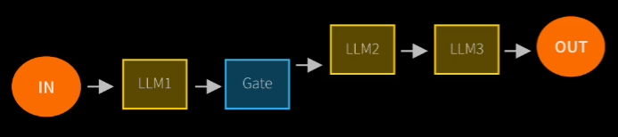
  <p><em>Reference: 1_lab1.ipynb</em></p>
</div>

### 2. Routing
Direct an input into a specialized sub-task, ensuring separation of concerns

<div align="center">
  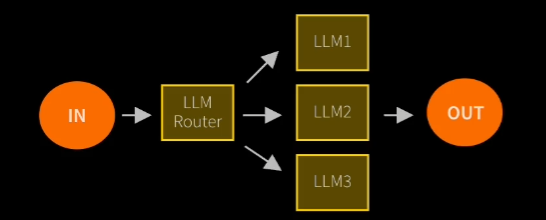
</div>

### 3. Parallelization
Breaking down tasks and running multiple subtasks concurrently, with code as the coordinator

<div align="center">
  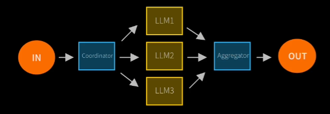
</div>

### 4. Orchestrator-Worker
Complex tasks are broken down dynamically and combined, with LLM as the orchestrator

<div align="center">
  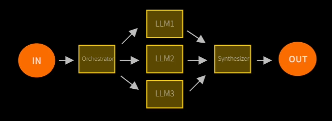
</div>

### 5. Evaluator-Optimizer
LLM output is validated by another LLM

<div align="center">
  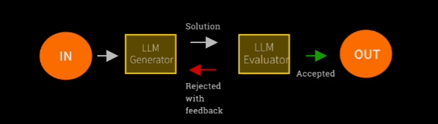
</div>

## Agents: Beyond Structured Workflows 🔄

Agents differ from workflows by being:

1. **Open-ended** - Not restricted to predefined pathways
2. **Driven by feedback loops** - Learning and adapting from results
3. **Not following fixed paths** - Dynamic problem-solving approaches

<div align="center">
  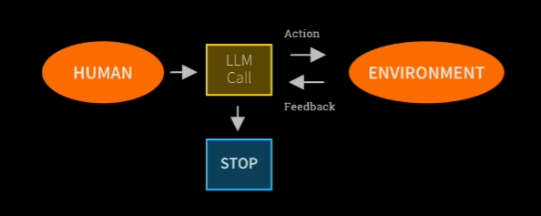
</div>

## Risk of Agent Frameworks ⚠️

<div align="center">
  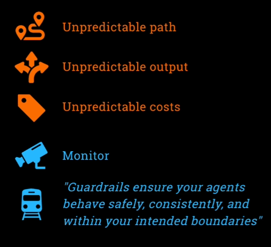
</div>

## Agentic AI Frameworks 🛠️

1. **No Framework** - Reference: 2_lab2.ipynb
2. **MCP** (Model-Context-Protocol)

## Complex Ones 🧩

1. **OpenAI Agents SDK** - Building intelligent agents with OpenAI's technology
2. **Crew AI** - Multi-agent framework for collaborative AI systems

## Top Level Complex 🔝

1. **LangGraph** - Orchestration framework for LLM applications
2. **AutoGen** - Multi-agent conversation framework for AI applications

Many, many more! Which to pick depends on the use case and preference

## Resources vs Tools: The Building Blocks 🧰

<p align="center">
  <strong>Understanding the key components that power AI agent systems</strong>
</p>

### 📚 Resources: Knowledge & Data

<div align="center">
  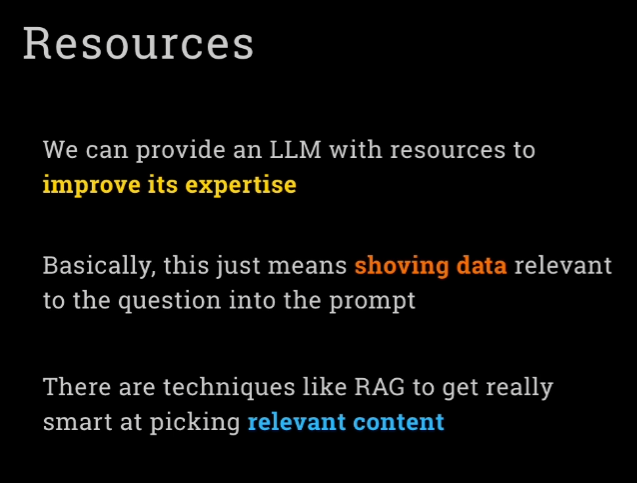
  <p><em>Information repositories that agents can access and utilize</em></p>
</div>

### 🛠️ Tools: Actions & Capabilities

<div align="center">
  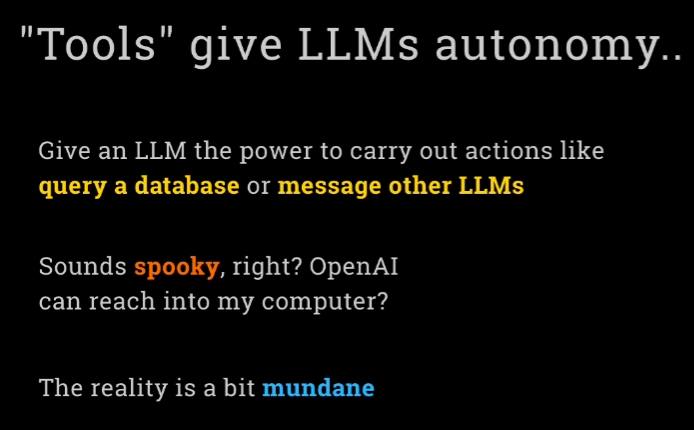
  <p><em>Functional abilities that enable agents to interact with their environment</em></p>
</div>

<div class="comparison-container" style="display: flex; justify-content: space-between; margin-top: 30px;">
  <div align="center" style="flex: 1; margin: 0 15px;">
    <h4>The Theory</h4>
    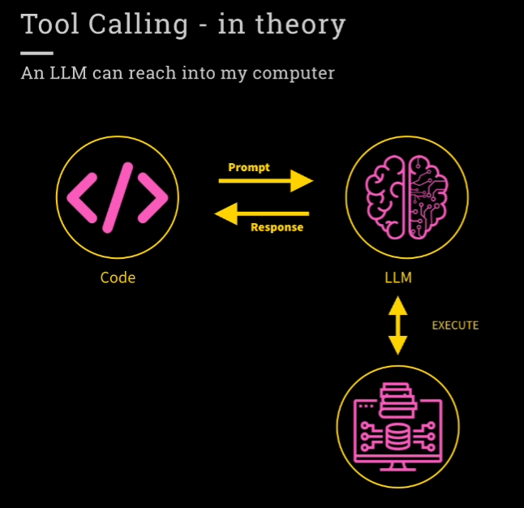
    <p><em>How tools are conceptualized in design</em></p>
  </div>

  <div align="center" style="flex: 1; margin: 0 15px;">
    <h4>The Practice</h4>
    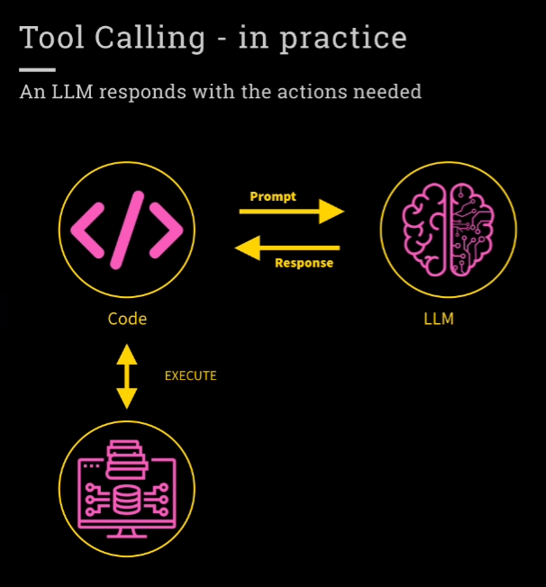
    <p><em>How tools function in real-world applications</em></p>
  </div>
</div>

---

<div align="center">
  <p><em>Reference Repository: <a href="https://github.com/ed-donner/agents">https://github.com/ed-donner/agents</a></em></p>
  <p>© 2025 AI Agents Framework</p>
</div>
