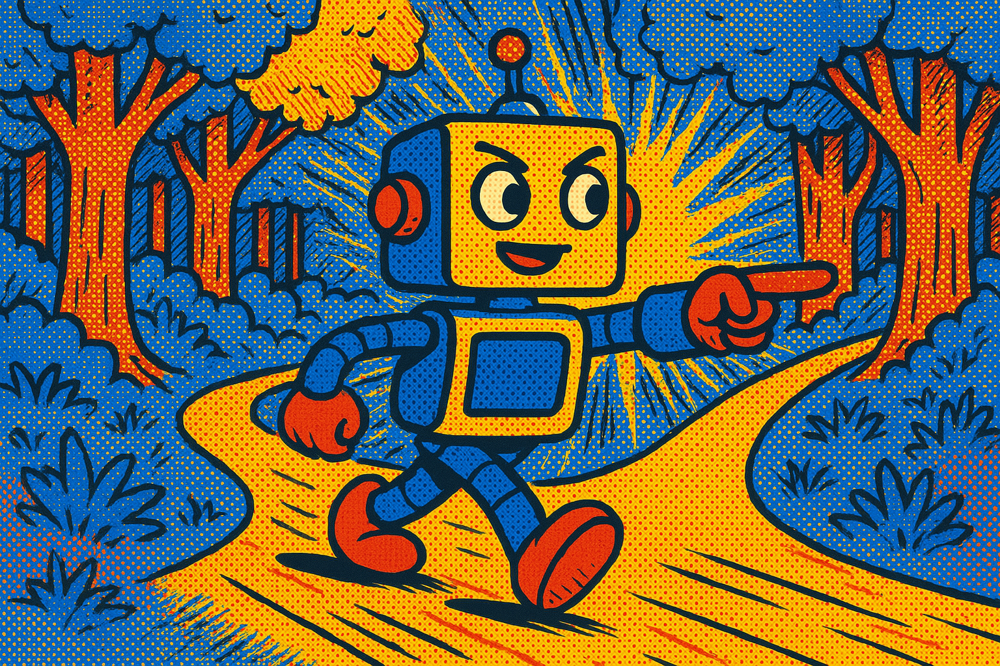

# 🤖 AI Agents Framework

<div align="center">

[](https://github.com/ed-donner/agents)
[](https://www.python.org/)
[](LICENSE)
[](https://github.com/ed-donner/agents)

<p align="center">
  
</p>

</div>

<p align="center">
  <strong>Exploring the world of AI agents, workflows, and autonomous systems</strong>
</p>

<hr style="height:2px;border-width:0;color:gray;background-color:#007ACC">

## Table of Contents 📋

- [🤖 AI Agents Framework](#-ai-agents-framework)
  - [Table of Contents 📋](#table-of-contents-)
  - [Getting Started 🚀](#getting-started-)
  - [What Are AI Agents? 🧠](#what-are-ai-agents-)
  - [Agentic Systems Architecture 🏗️](#agentic-systems-architecture-️)
  - [Five Workflow Design Patterns 📊](#five-workflow-design-patterns-)
    - [1. Prompt Chaining ⛓️](#1-prompt-chaining-️)
    - [2. Routing 🔀](#2-routing-)
    - [3. Parallelization ⚡](#3-parallelization-)
    - [4. Orchestrator-Worker 🎭](#4-orchestrator-worker-)
    - [5. Evaluator-Optimizer ✅](#5-evaluator-optimizer-)
  - [Agents: Beyond Structured Workflows 🔄](#agents-beyond-structured-workflows-)
  - [Risk of Agent Frameworks ⚠️](#risk-of-agent-frameworks-️)
  - [Agentic AI Frameworks 🛠️](#agentic-ai-frameworks-️)
  - [Complex Ones 🧩](#complex-ones-)
    - [OpenAI Agents SDK](#openai-agents-sdk)
    - [Crew AI 🤝](#crew-ai-)
      - [Offerings 📦](#offerings-)
      - [Provides 2 Frameworks 🧩](#provides-2-frameworks-)
      - [Core Concepts 🧠](#core-concepts-)
      - [YAML Configuration 📝](#yaml-configuration-)
      - [Crew PY Config 🐍](#crew-py-config-)
      - [Crew LiteLLM ⚡](#crew-litellm-)
      - [Crew Projects 🚀](#crew-projects-)
  - [Top Level Complex 🔝](#top-level-complex-)
  - [Resources vs Tools: The Building Blocks 🧰](#resources-vs-tools-the-building-blocks-)
    - [Resources: Knowledge \& Data 📚](#resources-knowledge--data-)
    - [Tools: Actions \& Capabilities 🛠️](#tools-actions--capabilities-️)
  - [OpenAI Agents SDK 🤖](#openai-agents-sdk-)
    - [Key Terminology 📚](#key-terminology-)
    - [Implementation Steps 📋](#implementation-steps-)
  - [Contributing 🤝](#contributing-)

<hr style="height:2px;border-width:0;color:gray;background-color:#007ACC">

## Getting Started 🚀

```bash
# Initialize your environment with dependencies
uv sync
# In case of any issues
uv self update
uv lock --upgrade
uv sync

# CrewAI
uv tool install crew
uv tool upgrade crew
```

<hr style="height:1px;border-width:0;color:gray;background-color:#e1e4e8">

## What Are AI Agents? 🧠

AI Agents are programs where LLM outputs control the workflow, featuring:

- **Multiple LLM calls** — Chaining language model interactions
- **LLMs with ability to use Tools** — Extending capabilities beyond text
- **An environment where LLMs interact** — Creating collaborative AI systems
- **A Planner to coordinate activities** — Orchestrating complex workflows
- **Autonomy** — Self-directed problem solving

<hr style="height:1px;border-width:0;color:gray;background-color:#e1e4e8">

## Agentic Systems Architecture 🏗️

Anthropic distinguishes two types of systems:

1. **Workflows**: Systems where LLMs and tools are orchestrated through predefined code paths
2. **Agents**: Systems where LLMs dynamically direct their own processes and tool usage, maintaining control over how they accomplish tasks

<hr style="height:1px;border-width:0;color:gray;background-color:#e1e4e8">

## Five Workflow Design Patterns 📊

### 1. Prompt Chaining ⛓️
Decompose tasks into fixed sub-tasks

<div align="center">
  
  <p><em>Reference: 1_lab1.ipynb</em></p>
</div>

### 2. Routing 🔀
Direct an input into a specialized sub-task, ensuring separation of concerns

<div align="center">
  
  <p><em>Routing pattern: Directing inputs to specialized handlers</em></p>
</div>

### 3. Parallelization ⚡
Breaking down tasks and running multiple subtasks concurrently, with code as the coordinator

<div align="center">
  
  <p><em>Parallelization pattern: Concurrent execution for efficiency</em></p>
</div>

### 4. Orchestrator-Worker 🎭
Complex tasks are broken down dynamically and combined, with LLM as the orchestrator

<div align="center">
  
  <p><em>Orchestrator-Worker pattern: LLM coordinates specialized workers</em></p>
</div>

### 5. Evaluator-Optimizer ✅
LLM output is validated by another LLM

<div align="center">
  
  <p><em>Evaluator-Optimizer pattern: Quality control through validation</em></p>
</div>

<hr style="height:1px;border-width:0;color:gray;background-color:#e1e4e8">

## Agents: Beyond Structured Workflows 🔄

Agents differ from workflows by being:

1. **Open-ended** — Not restricted to predefined pathways
2. **Driven by feedback loops** — Learning and adapting from results
3. **Not following fixed paths** — Dynamic problem-solving approaches

<div align="center">
  
  <p><em>The fundamental differences between fixed workflows and agentic systems</em></p>
</div>

<hr style="height:1px;border-width:0;color:gray;background-color:#e1e4e8">

## Risk of Agent Frameworks ⚠️

<div align="center">
  
  <p><em>Understanding and mitigating the inherent risks of autonomous AI systems</em></p>
</div>

<hr style="height:1px;border-width:0;color:gray;background-color:#e1e4e8">

## Agentic AI Frameworks 🛠️

1. **No Framework** — Reference implementation in [2_lab2.ipynb](./1_foundations/2_lab2.ipynb)
2. **MCP** (Model-Context-Protocol) — Standardized communication protocol for agent interactions

<hr style="height:1px;border-width:0;color:gray;background-color:#e1e4e8">

## Complex Ones 🧩

### OpenAI Agents SDK
- Building intelligent agents with OpenAI's technology

<div align="center">
  
  <p><em>OpenAI's framework for building, deploying, and managing intelligent agents</em></p>
</div>

### Crew AI 🤝

Crew AI is a multi-agent framework for collaborative AI systems, enabling teams of agents to work together efficiently on complex tasks.

#### Offerings 📦

<div align="center">
  
  <p><em>Comprehensive offerings for building and managing agent teams</em></p>
</div>

#### Provides 2 Frameworks 🧩

<div align="center">
  
  <p><em>Provides two main frameworks for agent collaboration</em></p>
</div>

#### Core Concepts 🧠

<div align="center">
  
  <p><em>Key ideas and building blocks in Crew AI</em></p>
</div>

#### YAML Configuration 📝

<div align="center">
  
  <p><em>Example of Crew AI YAML-based configuration</em></p>
</div>

#### Crew PY Config 🐍

<div align="center">
  
  <p><em>Example of Crew AI Python-based configuration</em></p>
</div>

#### Crew LiteLLM ⚡

<div align="center">
  
  <p><em>Example of Crew AI Python-based configuration</em></p>
</div>

#### Crew Projects 🚀

<div align="center">
  
  <p><em>Example of Crew AI Python-based configuration</em></p>
</div>

<hr style="height:1px;border-width:0;color:gray;background-color:#e1e4e8">

## Top Level Complex 🔝

1. **LangGraph** — Orchestration framework for LLM applications
2. **AutoGen** — Multi-agent conversation framework for AI applications

<p><em>Many, many more! Which to pick depends on the use case and preference</em></p>

<hr style="height:2px;border-width:0;color:gray;background-color:#007ACC">

## Resources vs Tools: The Building Blocks 🧰

<p align="center">
  <strong>Understanding the key components that power AI agent systems</strong>
</p>

### Resources: Knowledge & Data 📚

<div align="center">
  
  <p><em>Information repositories that agents can access and utilize</em></p>
</div>

### Tools: Actions & Capabilities 🛠️

<div align="center">
  <h3>Theory vs Practice 📊</h3>
  <table>
    <tr>
      <td align="center" width="50%">
        <h4>The Theory 📝</h4>
        
        <p><em>How tools are conceptualized in design</em></p>
      </td>
      <td align="center" width="50%">
        <h4>The Practice ⚙️</h4>
        
        <p><em>How tools function in real-world applications</em></p>
      </td>
    </tr>
  </table>
</div>

<hr style="height:1px;border-width:0;color:gray;background-color:#e1e4e8">

## OpenAI Agents SDK 🤖

<div align="center">
  
  <p><em>OpenAI's framework for building, deploying, and managing intelligent agents</em></p>
</div>

### Key Terminology 📚

<div align="center">
  
  <p><em>Essential concepts and vocabulary for working with the OpenAI Agents SDK</em></p>
</div>

### Implementation Steps 📋

<div align="center">
  
  <p><em>Workflow process for implementing agents with OpenAI's SDK</em></p>
</div>

<hr style="height:2px;border-width:0;color:gray;background-color:#007ACC">

## Contributing 🤝

We welcome contributions to this project! Feel free to:

- Submit pull requests for new features or improvements
- Report issues or bugs
- Suggest new ideas via the issue tracker

<div align="center">
  
  <p><em>We appreciate your interest and contributions!</em></p>
</div>

<div align="center">
  <p><em>Reference Repository: <a href="https://github.com/ed-donner/agents">https://github.com/ed-donner/agents</a></em></p>
</div>
