# 🤖 AI Agents Framework

<div align="center">


<p align="center">  </p>
</div>

<p align="center"><strong>Exploring the world of AI agents, workflows, and autonomous systems</strong></p>

---

## 📋 Table of Contents
- [🤖 AI Agents Framework](#-ai-agents-framework)
  - [📋 Table of Contents](#-table-of-contents)
  - [🚀 Getting Started](#-getting-started)
  - [🧠 What Are AI Agents?](#-what-are-ai-agents)
  - [🏗️ Agentic Systems Architecture](#-agentic-systems-architecture)
  - [📊 Five Workflow Design Patterns](#-five-workflow-design-patterns)
    - [⛓️ Prompt Chaining](#️-prompt-chaining)
    - [🔀 Routing](#-routing)
    - [⚡ Parallelization](#-parallelization)
    - [🎭 Orchestrator-Worker](#-orchestrator-worker)
    - [✅ Evaluator-Optimizer](#-evaluator-optimizer)
  - [🔄 Agents: Beyond Structured Workflows](#-agents-beyond-structured-workflows)
  - [⚠️ Risk of Agent Frameworks](#-risk-of-agent-frameworks)
  - [🛠️ Agentic AI Frameworks](#-agentic-ai-frameworks)
  - [🧹 Complex Ones](#-complex-ones)
    - [🤖 OpenAI Agents SDK](#-openai-agents-sdk)
    - [🤝 Crew AI](#-crew-ai)
      - [📦 Offerings](#-offerings)
      - [🧹 Provides 2 Frameworks](#-provides-2-frameworks)
      - [🧠 Core Concepts](#-core-concepts)
      - [📝 YAML Configuration](#-yaml-configuration)
      - [🐍 Crew PY Config](#-crew-py-config)
      - [⚡ Crew LiteLLM](#-crew-litellm)
      - [🚀 Crew Projects](#-crew-projects)
      - [🧠 Coder Output](#-coder-output)
  - [🔝 Top Level Complex](#-top-level-complex)
    - [🔸 LangGraph](#-langgraph)
      - [🌐 The LangChain Ecosystem](#-the-langchain-ecosystem)
      - [📖 Terminology](#-terminology)
      - [🪜 Five Steps to the First Graph](#-five-steps-to-the-first-graph)
      - [🧠 State](#-state)
      - [🔍 LangSmith](#-langsmith)
      - [⚙️ The Super-Step](#-the-super-step)
    - [🧠 AutoGen](#-autogen)
      - [⚙️ Core Concepts](#-core-concepts-1)
      - [🌐 Distributed Runtime](#-distributed-runtime)
  - [🧰 Resources vs Tools: The Building Blocks](#-resources-vs-tools-the-building-blocks)
    - [📚 Resources: Knowledge & Data](#-resources-knowledge--data)
    - [🛠️ Tools: Actions & Capabilities](#-tools-actions--capabilities)
  - [🤖 OpenAI Agents SDK](#-openai-agents-sdk-1)
    - [📚 Key Terminology](#-key-terminology)
    - [📋 Implementation Steps](#-implementation-steps)
  - [🤝 Contributing](#-contributing)

---

## Getting Started 🚀

```bash
# Initialize your environment with dependencies
uv sync
# In case of any issues
uv self update
uv lock --upgrade
uv sync

# CrewAI
uv tool install crew
uv tool upgrade crew
```

---

## What Are AI Agents? 🧠
AI Agents are programs where LLM outputs control the workflow, featuring:

- **Multiple LLM calls** — Chaining language model interactions
- **LLMs with ability to use Tools** — Extending capabilities beyond text
- **An environment where LLMs interact** — Creating collaborative AI systems
- **A Planner to coordinate activities** — Orchestrating complex workflows
- **Autonomy** — Self-directed problem solving

---

## Agentic Systems Architecture 🏗️
Anthropic distinguishes two types of systems:

- **Workflows:** Systems where LLMs and tools are orchestrated through predefined code paths
- **Agents:** Systems where LLMs dynamically direct their own processes and tool usage, maintaining control over how they accomplish tasks

---

## Five Workflow Design Patterns 📊

### 1. Prompt Chaining ⛓️
Decompose tasks into fixed sub-tasks
<div align="center">  <p><em>Reference: 1_lab1.ipynb</em></p> </div>

### 2. Routing 🔀
Direct an input into a specialized sub-task, ensuring separation of concerns
<div align="center">  <p><em>Routing pattern: Directing inputs to specialized handlers</em></p> </div>

### 3. Parallelization ⚡
Breaking down tasks and running multiple subtasks concurrently, with code as the coordinator
<div align="center">  <p><em>Parallelization pattern: Concurrent execution for efficiency</em></p> </div>

### 4. Orchestrator-Worker 🎭
Complex tasks are broken down dynamically and combined, with LLM as the orchestrator
<div align="center">  <p><em>Orchestrator-Worker pattern: LLM coordinates specialized workers</em></p> </div>

### 5. Evaluator-Optimizer ✅
LLM output is validated by another LLM
<div align="center">  <p><em>Evaluator-Optimizer pattern: Quality control through validation</em></p> </div>

---

## Agents: Beyond Structured Workflows 🔄
Agents differ from workflows by being:

- **Open-ended** — Not restricted to predefined pathways
- **Driven by feedback loops** — Learning and adapting from results
- **Not following fixed paths** — Dynamic problem-solving approaches
<div align="center">  <p><em>The fundamental differences between fixed workflows and agentic systems</em></p> </div>

---

## Risk of Agent Frameworks ⚠️
<div align="center">  <p><em>Understanding and mitigating the inherent risks of autonomous AI systems</em></p> </div>

---

## Agentic AI Frameworks 🛠️
- **No Framework** — Reference implementation in 2_lab2.ipynb
- **MCP (Model-Context-Protocol)** — Standardized communication protocol for agent interactions

---

## Complex Ones 🧩

### OpenAI Agents SDK 🤖
- Building intelligent agents with OpenAI's technology
<div align="center">  <p><em>OpenAI's framework for building, deploying, and managing intelligent agents</em></p> </div>

### Crew AI 🤝
Crew AI is a multi-agent framework for collaborative AI systems, enabling teams of agents to work together efficiently on complex tasks.

#### Offerings 📦
<div align="center">  <p><em>Comprehensive offerings for building and managing agent teams</em></p> </div>

#### Provides 2 Frameworks 🧩
<div align="center">  <p><em>Provides two main frameworks for agent collaboration</em></p> </div>

#### Core Concepts 🧠
<div align="center">  <p><em>Key ideas and building blocks in Crew AI</em></p> </div>

#### YAML Configuration 📝
<div align="center">  <p><em>Example of Crew AI YAML-based configuration</em></p> </div>

#### Crew PY Config 🐍
<div align="center">  <p><em>Example of Crew AI Python-based configuration</em></p> </div>

#### Crew LiteLLM ⚡
<div align="center">  <p><em>Example of Crew AI Python-based configuration</em></p> </div>

#### Crew Projects 🚀
<div align="center">  <p><em>Example of Crew AI Python-based configuration</em></p> </div>

#### Coder Output 🧠
<div align="center"> 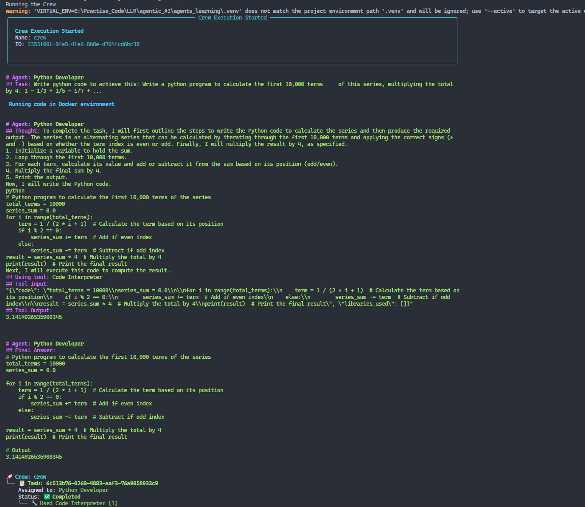 <p><em>Example of Crew AI Output1</em></p> </div>
<div align="center"> 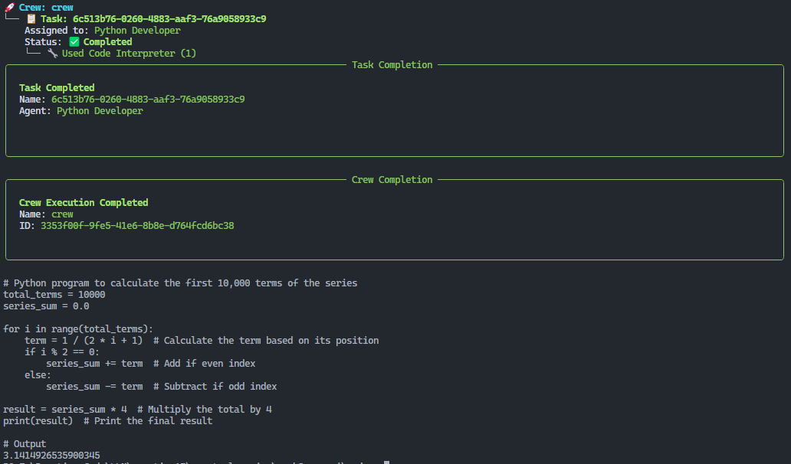 <p><em>Example of Crew AI Output2</em></p> </div>

---

## Top Level Complex 🔝
- **LangGraph** — Orchestration framework for LLM applications

## 🌐 The LangChain Ecosystem
<div align="center"> 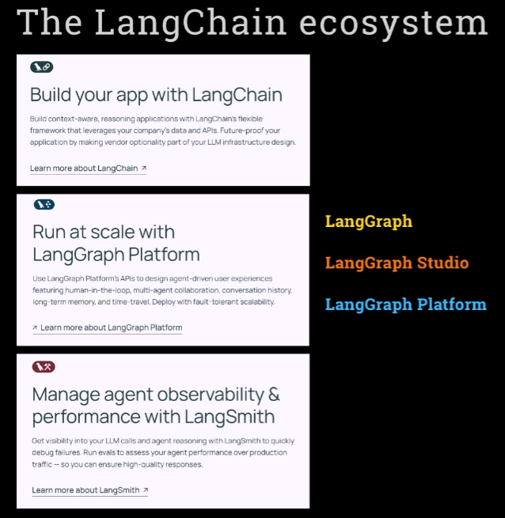 <p><em>Example of LangChain Ecosystem</em></p> </div>

## 📖 Terminologies
<div align="center"> 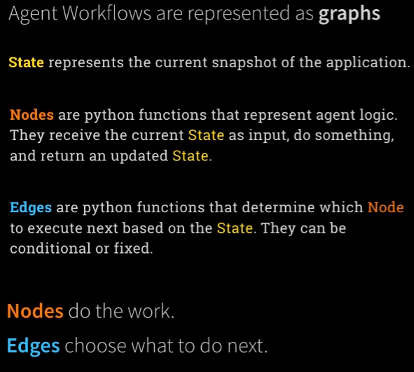 <p><em>LangGraph Terminology</em></p> </div>
<div align="center"> 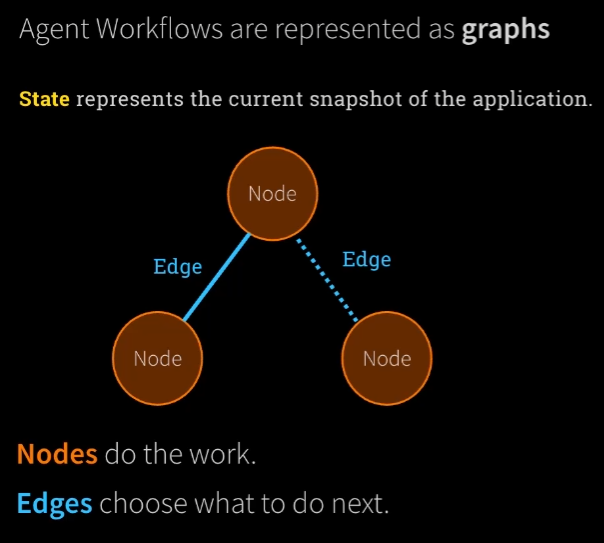 <p><em>LangGraph Terminology</em></p> </div>

## 🪜 Five Steps to the First Graph
<div align="center"> 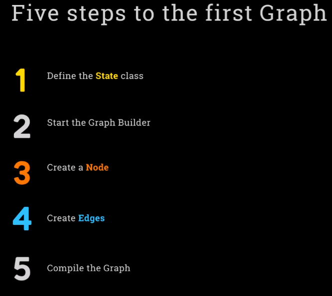 <p><em>5 Steps to the First Graph</em></p> </div>

## 🧠 State
<div align="center"> 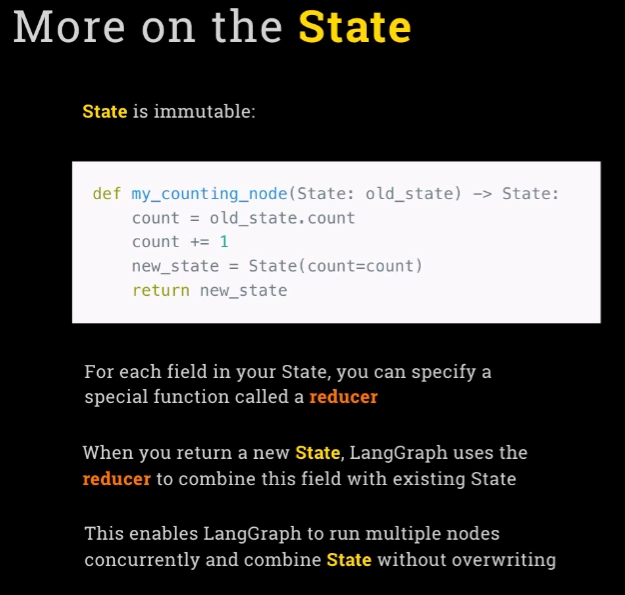 <p><em>LangGraph State</em></p> </div>

## 🧪 LangSmith
<div align="center"> 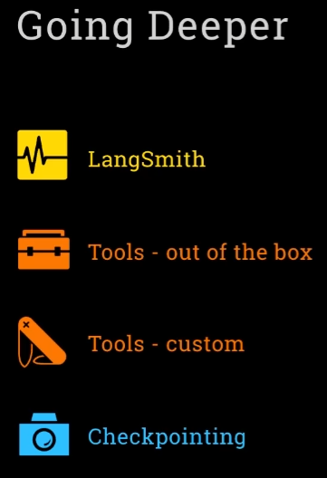 <p><em>LangSmith</em></p> </div>

### ⚙️ The Super-Step
<div align="center"> 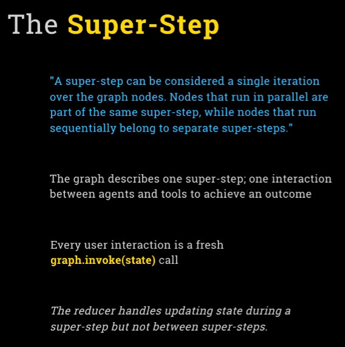 <p><em>Super Step</em></p> </div>
<div align="center"> 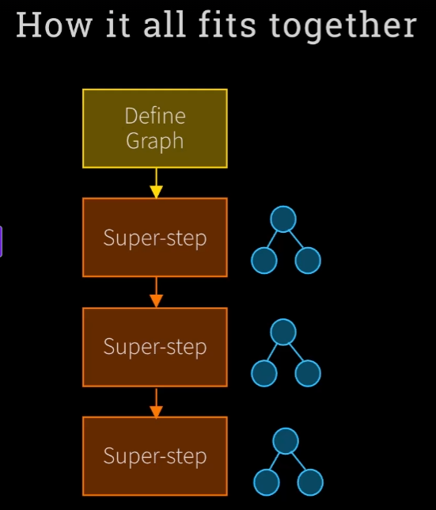 <p><em>Super Step Explanation</em></p> </div>

## 🧠 AutoGen
AutoGen is a multi-agent conversation framework enabling LLM agents to work together to accomplish complex tasks in a coordinated manner.

<div align="center">
  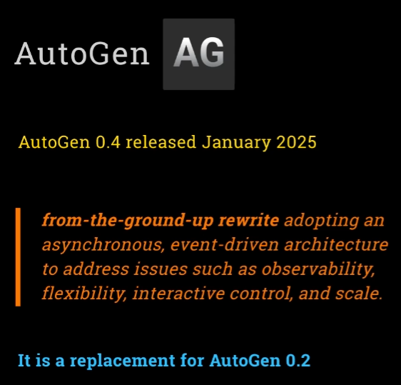
  <p><em>AutoGen multi-agent system</em></p>
</div>

<div align="center">
  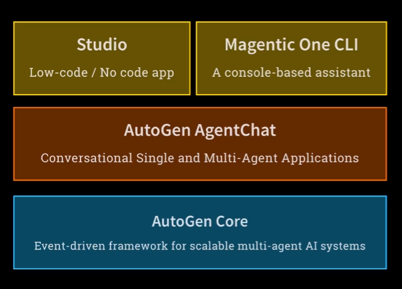
  <p><em>Framework Architecture</em></p>
</div>

### 🧩 Core Concepts
<div align="center">
  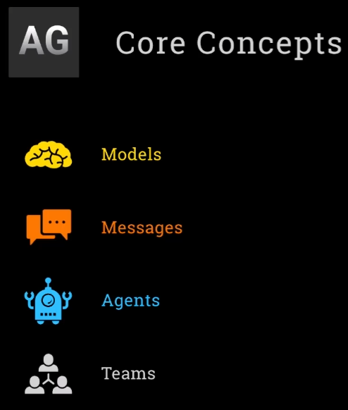
  <p><em>Role-based agent architecture with dynamic interactions</em></p>
</div>

### 🌐 Distributed Runtime

<div align="center">
  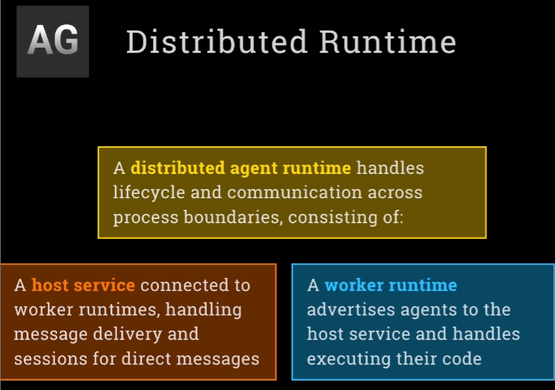
  <p><em>Distributed Runtime</em></p>
</div>

- **Assistant Agents**: Role-driven agents that take actions, perform tasks, or serve as knowledge agents.
- **User Proxy Agent**: Simulates the user role, triggering tasks, and interacting with assistant agents.
- **Group Chat / Group Controller**: Coordinates multiple agents in a task-focused dialogue.
- **Tool Integration**: Seamless inclusion of external tools for agents to act upon.


<p><em>Many, many more! Which to pick depends on the use case and preference</em></p>

---

## Resources vs Tools: The Building Blocks 🧰
<p align="center"> <strong>Understanding the key components that power AI agent systems</strong> </p>

### Resources: Knowledge & Data 📚
<div align="center">  <p><em>Information repositories that agents can access and utilize</em></p> </div>

### Tools: Actions & Capabilities 🛠️
<div align="center"> <h3>Theory vs Practice 📊</h3> <table> <tr> <td align="center" width="50%"> <h4>The Theory 📝</h4>  <p><em>How tools are conceptualized in design</em></p> </td> <td align="center" width="50%"> <h4>The Practice ⚙️</h4>  <p><em>How tools function in real-world applications</em></p> </td> </tr> </table> </div>

---

## OpenAI Agents SDK 🤖
<div align="center">  <p><em>OpenAI's framework for building, deploying, and managing intelligent agents</em></p> </div>

### Key Terminology 📚
<div align="center">  <p><em>Essential concepts and vocabulary for working with the OpenAI Agents SDK</em></p> </div>

### Implementation Steps 📋
<div align="center">  <p><em>Workflow process for implementing agents with OpenAI's SDK</em></p> </div>

---

## Contributing 🤝
We welcome contributions to this project! Feel free to:

- Submit pull requests for new features or improvements
- Report issues or bugs
- Suggest new ideas via the issue tracker

<div align="center">  <p><em>We appreciate your interest and contributions!</em></p> </div>
<div align="center"> <p><em>Reference Repository: <a href="https://github.com/ed-donner/agents">https://github.com/ed-donner/agents</a></em></p> </div>
